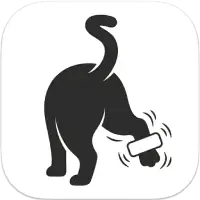

<div align="center">
  
  <h1>CatLabel Studio</h1>
</div>

CatLabel is a local web application for designing and printing labels to portable Bluetooth thermal printers. 

It is a fork of [TiMini Print](https://github.com/Dejniel/TiMini-Print). CatLabel moves the original CLI and Tkinter-based logic into a web interface built with FastAPI and React, while adding native support for Niimbot.

https://github.com/user-attachments/assets/d7103905-7133-41c0-b20b-ee69727d9418

---


---

## Supported Printers

CatLabel communicates directly with portable thermal printers over Bluetooth. It supports many models that do not use standard ESC/POS commands.

*   **Niimbot:** D-Series (D11, D110, D101; experimental D11S 203 DPI profile), B-Series (B1, B21, B3S, B24, B18).
*   **Phomemo:** M-Series (M02, M02S, M02X, M03, M04, M200), D-Series (D30), T02, P12, PM-241.
*   **Generic:** 136 executable model records from the pinned TiMini-Print v0.8.1 catalog and selected Luck/PrintMaster updates across Tiny/Tiny-prefixed, Luck, V5G/V5X/V5C, Eleph/ToPrint, Instaprint Core, Funny LX, Orgstra S001, and PrintMaster families. Detection uses advertised names and MAC constraints from the catalog; models owned by the separate Niimbot and Phomemo backends are not duplicated.

Exact M110/M120 names select experimental PrintMaster recipes. Unconfirmed suffixes, M220 and the unconfirmed M221/M260 aliases remain unknown. Phomemo P12/D-series/M03/M04/M200 support uses existing local recipes. Changed printer paths have source-backed tests; physical printer acceptance is still open. See the [upstream parity ledger](docs/upstream-parity.md) for pinned sources and remaining differences.

---

## Installation & Running

CatLabel runs a local web server and opens the interface in your browser. The installation scripts manage a locked, isolated Python environment with a checksum-verified copy of Pixi. You do not need system Python or Node.js. First setup needs internet access; subsequent launches use the installed environment.

### Windows
Download or clone this repository into a writable folder and double-click `run.bat`. It installs the locked environment and starts CatLabel. Windows support is best effort; native installation has not been verified in this maintenance run.

The existing standalone launcher on the [Releases](../../releases) page may predate these scripts. Its release/update workflow is being revised as part of the maintenance plan.

https://github.com/user-attachments/assets/4e784645-0ccf-478c-a6e1-0c41a3519624

### macOS & Linux
1. Clone or download this repository.
2. Open a terminal in the repository folder.
3. Run `bash ./run.sh`.
4. The script downloads verified Pixi, installs the locked dependencies, and starts the server. The compiled frontend is included. macOS support is best effort; native execution has not been verified in this maintenance run.

Both scripts accept `--setup-only`, `--install-headless`, `--skip-headless`, `--install-ai`, `--skip-ai`, `--repair` and `--diagnose`. Headless Chromium is an explicit add-on for backend HTML rendering. Normal browser design and printing do not need it. Cloud chat SDKs are another independent add-on, enabled with `--install-ai`. See [installation and recovery](docs/installation.md) for data paths, optional setup and diagnostics.

*The app runs at [http://localhost:8000](http://localhost:8000).*

CatLabel listens on this computer only by default. See [local operation and API clients](docs/local-operation.md) for optional LAN access, access tokens, developer origins.

See [print jobs and hardware acceptance](docs/print-jobs.md) for busy-printer responses, uncertain delivery and physical acceptance status.

API clients should also follow the [resource limits](docs/resource-limits.md) and [project revision/import contract](docs/project-persistence.md).

---

## Instruction Manual & Features

CatLabel is divided into a sidebar (for printers and files), a central canvas, and a right-hand properties panel.

### 1. Canvas Editor (WYSIWYG)
The visual editor allows you to place text, barcodes, QR codes, icons, shapes, and images.
*   **Precision Control:** In the right panel, you can adjust X/Y coordinates and dimensions using millimeter inputs. Click and drag horizontally on the input labels (where you see `⇹`) to scrub the values up and down smoothly.
*   **Icons & Images:** The toolbar includes a searchable Lucide icon library. Standard images are automatically thresholded (converted to black and white) and dithered to print clearly on thermal heads.
*   **Z-Order & Grouping:** Use the toolbar to bring elements forward or backward. You can select multiple items (hold `Shift`) to group them together for moving and scaling.

### 2. Designing with HTML & CSS
For complex layouts (like shipping labels or split columns), each label page can include a sanitized HTML/CSS background together with visual drag-and-drop elements. HTML and canvas elements are composited in the same page during preview and printing.

**Auto-Scaling Text:** 
If you wrap text in an `.auto-text` class inside a `.bound-box` container, CatLabel will calculate and apply the exact font size needed to maximize the text within that box. This prevents text from overflowing or being too small without requiring manual font-size guessing.

**Example Layout:**
```html
<div style="display: flex; flex-direction: column; height: 100%; padding: 4px; gap: 4px;">
  <!-- Top half: Auto-scaling Title -->
  <div class="bound-box" style="flex: 2;">
    <div class="auto-text" style="font-weight: 900;">{{ product_name }}</div>
  </div>
  
  <!-- Divider -->
  <div style="height: 2px; background: black; width: 100%;"></div>
  
  <!-- Bottom half: Dynamic Barcode -->
  <div class="bound-box" style="flex: 1;">
    <div class="catlabel-code" data-type="barcode" data-format="code128" data-value="{{ sku }}"></div>
  </div>
</div>
```
*Note: To add background patterns or colors, place an absolutely positioned `div` behind your flex containers to ensure the bounding box calculations remain accurate.*

### 3. Variables & Batch Printing
You can design a single template and print multiple variations using variables.
1. Type `{{ any_name }}` into a text element, barcode data field, or HTML block.
2. Open the **Batch Data** tab in the right panel. The system will automatically detect your variables.
3. Choose your data input method:
   *   **Table:** Manually type rows of data, or use the "Import CSV" button to map spreadsheet columns to your variables.
   *   **Permutations (Matrix):** Enter comma-separated lists for each variable. The app will generate every possible combination (e.g., Size: S, M, L / Color: Red, Blue).
   *   **Sequence:** Select a variable and set a start number, end number, prefix, and zero-padding to instantly generate serialized labels (e.g., `BOX-001` to `BOX-050`).

### 4. Wizards & Templates
The toolbar includes a "Wizards" dropdown with built-in forms. These generate standard layouts for specific use cases:
*   **Shipping Labels:** Includes an address book to save frequently used senders/recipients.
*   **Price Tags:** Formats currency, large main prices, and underlined cents alongside a barcode.
*   **Inventory & IT Assets:** Creates a high-contrast department header and paired QR code.
*   **Date Tool:** Quickly insert today's date, or calculate offset dates (e.g., "+7 Days" for food expiry).

### 5. AI Layout Assistant
CatLabel includes a chat interface that can write HTML layouts and execute tool commands based on your text requests. It operates in two modes:
*   **Live Agent:** Enter API keys for OpenAI, Google Gemini, or Vertex AI. You can also point it to a local LLM host (like LM Studio or Ollama) by selecting "Custom" and using `http://localhost:1234/v1`.
*   **External (Copy/Paste):** If you already pay for ChatGPT Plus or Claude Pro, you can generate a system prompt block here, paste it into your browser tab, and paste the resulting JSON back into CatLabel. This applies the layout without consuming API credits.

### 6. Project Management
The sidebar contains a file tree to save your designs.
*   You can create folders and drag-and-drop projects between them.
*   Projects save the canvas dimensions, per-page HTML/template layouts, page-indexed elements, and your currently loaded batch data.
*   You can export individual projects or entire folders as JSON files to back them up or share them.

### 7. Printer Settings (Hardware Overrides)
In the **Canvas & Printer** tab, you can override default hardware behaviors:
*   **Density / Energy:** Increase this value to make prints darker (useful for transparent or synthetic label stock), or decrease it if the print head is smudging. V5G printers accept raw density overrides from 1–200; `0` keeps the model default. The UI also shows the model-tuned range, and the runtime may reduce an override while the print head is hot.
*   **Feed Lines:** Controls how much blank tape is ejected after a print job to align the cut with the printer's tear-off teeth.
*   **Split Mode:** Allows you to define a canvas larger than the printer's physical width. The app will slice the image and print it in sequential strips.

---

## Troubleshooting & Bluetooth

*   **Windows Pairing:** Windows sometimes refuses to communicate with generic SPP (Serial Port Profile) printers unless they are explicitly paired in the Windows Settings menu first. If the app fails to connect, pair it manually in Windows, then try again.
*   **macOS Connections:** Apple restricts classic Bluetooth SPP connections. CatLabel uses a custom PyObjC bridge to handle this, but you may occasionally need to restart the printer if macOS caches a stale connection state.
*   **Niimbot Printers:** Niimbot devices use Bluetooth Low Energy (BLE). They do not require OS-level pairing. The app will connect to them directly.
*   **Headless API Rendering:** Normal browser-based design and printing does not require Playwright. Third-party scripts that ask the backend API to rasterize HTML do require the optional headless Chromium environment. On Windows, install or repair it with `catlabel\run.bat --install-headless` from the folder containing the launcher.

---

## Architecture

*   **Backend (`catlabel/`):** A FastAPI server with separate device policy, printing runtime, stateless protocol encoding, and Bluetooth transport layers. Generic printer metadata is a reproducible snapshot pinned to TiMini-Print v0.8.1.
*   **Frontend (`frontend/`):** A React application using Zustand for state management and Konva.js for the interactive canvas. Pages are represented by the union of page-indexed canvas elements and `pageLayouts`; rendering never inherits content from another page.

See the [backend architecture](docs/architecture.md), [frontend architecture](docs/frontend-architecture.md), and [upstream synchronization ledger](docs/upstream-sync.md) for layer ownership, document invariants, imported changes, and intentionally deferred printer families.

For contributors, see the [development check policy](docs/development-checks.md) and [maintenance implementation ledger](docs/maintenance-progress.md). Checks use a locked disposable test environment and build without replacing release assets.

---

## License & Attribution

This project is a fork of [TiMini Print](https://github.com/Dejniel/TiMini-Print) by Dejniel. The original reverse-engineering of the V5/Generic printer protocols and the core encoding logic belong to the original author.

CatLabel is distributed under the **Apache License 2.0**.
