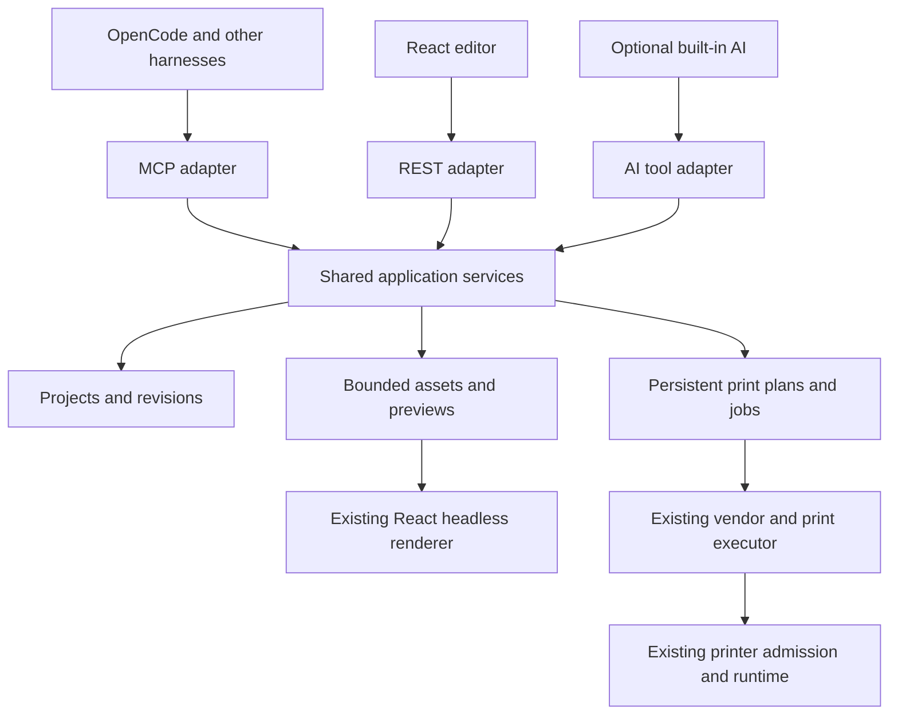

# Harness workflow and MCP architecture

Date: 3 October 2026. First acceptance target: OpenCode on Linux.
Status: initial Streamable HTTP implementation completed. The sections below retain the architecture contract; deferred capabilities are listed under Delivery scope.
Baseline: `fc95a0a9cbf499fb8e7f70f1ae947ef530e59968`.

## Decision

Expose CatLabel's existing application through a thin MCP adapter. The application
process remains the sole owner of the database, renderer, printer admission and
hardware. Extract shared application services from route handlers before exposing
them. REST, MCP and built-in AI call those services; no adapter calls another
adapter's tool dispatcher or mutates printer state independently.

Use the official Python SDK, initially pinned to `mcp==2.3.0`, with a locked
optional MCP/headless environment. No Node MCP backend, second rendering engine,
LLM provider, Redis, or second database is needed. Ordinary interactive design and
printing keep their lightweight installation.

## Current reusable boundaries and necessary extraction

| Current surface | Reuse or required change |
| --- | --- |
| `api/routes_project.py` | Preserve summary pagination and SQL revision comparison. Move persistence operations into `services/projects.py`; routes become adapters. |
| `services/ai_tools.py` | Preserve useful design operations, but extract pure document edits and typed outcomes. Its string errors and browser-action queue are not an MCP contract. Keep the built-in AI's existing review behavior. |
| `rendering/template.py` and `frontend/src/HeadlessRenderer.jsx` | Reuse the bounded browser renderer, streamed page handoff and the same `HeadlessPage`/canvas item components as the editor. |
| `api/routes_print.py` | Extract discovery/profile access and the existing owned execution path into application services. Keep vendor protocols, preflight and admission authoritative. |
| `services/prepared_prints.py` | Reuse PNG validation, ordered staging and lease cleanup. Its process-local 15-minute sessions do not provide durable jobs or restart recovery. |
| `core/runtime_lease.py` | Preserve one authoritative process per data directory. MCP connections do not create hardware-owning processes. |
| `core/server_security.py`, `api/security.py`, request/resource limits | Extend the existing local security and size boundaries to MCP, resources and artifact delivery. Do not assume `/api` middleware automatically protects a mounted `/mcp`. |

Existing success receipts indicate submission, with physical completion unverified.
Their short job IDs are not a queryable job registry. Existing profile reads create
missing defaults; extract a side-effect-free inspection operation before labeling
MCP inspection as read-only. The existing project dictionary and render-budget
checks are not a complete design schema.

## Transport, protocol and compatibility

Mount Streamable HTTP with canonical URL `/mcp/` in the existing FastAPI application. This is the
first OpenCode transport. Enter the SDK session-manager context explicitly from
the host lifespan after creating its ASGI application. Share the renderer and job
worker lifecycle with the host. Legacy session state is transport state only.

Support July `2026-07-28` discovery and per-request protocol/capability metadata,
and retain the SDK's legacy initialization path. The required fallback test is
`2025-11-25`; also cover `2025-06-18` if a target client negotiates it. Report the
actual negotiated revision; do not merely advertise July while using legacy wire
behavior. Reject unsupported versions according to the protocol.

Keep core workflow tools usable without subscriptions, sampling, elicitation or
the Tasks extension. July's Tasks extension is not implemented by SDK 2.3.0.
Persistent CatLabel jobs therefore use ordinary start/status/list/cancel tools.
Notifications and progress improve presentation, but polling remains sufficient.
Add a standards-based Tasks adapter later when the pinned SDK supports it; it
must refer to the same application job IDs and runner.

A stdio option follows the first HTTP slice if needed by the selected clients.
It uses the same SDK tool/resource registry and a typed HTTP gateway into the
running application's REST services. It does not open SQLite or printers. Keep
protocol messages on stdout and logs on stderr. Avoid a custom JSON-RPC relay.
If the app is absent, the launcher may start the authoritative app without opening
a browser, then wait for readiness; it must attach to an existing compatible
instance and never bypass the runtime lease. Legacy SSE is not required by the
first target and is deferred.

## One design and template contract

Keep the existing version-1 canvas document and its pixel/DPI representation.
Expose physical millimetres for creation and resizing, converting with the actual
DPI; remove the AI schema's approximate assumption that a millimetre is always
eight pixels. Preserve page indices, nested groups, HTML, QR/barcodes, templates,
batch records, copies and rotations.

Create one checked-in JSON Schema for the wire document, supported edit operations
and shared result envelopes. Validate it on backend writes and generate/check
frontend types from it. Migrate legacy shapes at a defined read boundary; preserve
supported existing fields rather than silently stripping them. Enforce finite
geometry, supported element kinds, unique IDs, recursive depth, byte/pixel/page
limits and valid page references. Cross-language fixture tests establish migration
and geometry parity; they do not require moving React rendering into Python.

Provide a small atomic operation set: add/update/remove an element, add/duplicate/
remove a page, set geometry/border, apply a template and set batch data. Every
saved edit requires `expected_revision`; validate all operations before committing
one revision. Do not overwrite a whole document merely to move one item.
Full-document import remains a separately validated operation.

Audit the existing Python and JavaScript template metadata together, choose one
canonical catalog, and generate the other representation. Store template IDs and
parameters; let the existing React generator produce markup. Do not introduce a
third template catalog or reproduce template HTML in MCP handlers.

The first workflow uses saved projects as designs. An external client can create
a named working copy or edit a saved design. Unsaved browser state is not silently
made authoritative on the server. Existing revision guards prevent overwriting
saved concurrent edits; the editor must also detect an external revision and offer
reload without replacing a dirty canvas or resetting its undo history.

## Initial tool surface

Use explicit tools with concise schemas and accurate annotations. A small catalog
query may use a fixed enum; do not expose an arbitrary operation/code dispatcher.
The initial target is approximately twenty tools, adjusted for coherent schemas.

| Group | Operations |
| --- | --- |
| Discovery | `catlabel_server_info`, `catlabel_catalog_get` for schema, fonts, templates, presets and supported models |
| Designs | `catlabel_design_list`, `catlabel_design_get`, `catlabel_design_create`, `catlabel_design_apply`, `catlabel_design_copy`, `catlabel_design_export` |
| Organization | `catlabel_categories_list`, `catlabel_category_upsert` |
| Inputs | `catlabel_asset_import` for bounded image/PDF bytes; return managed asset references and PDF page metadata |
| Preview | `catlabel_preview_create`, `catlabel_preview_get` |
| Printers | `catlabel_printers_scan`, `catlabel_printer_get`, `catlabel_printer_profile_update` |
| Printing | `catlabel_print_prepare`, `catlabel_print_start`, `catlabel_job_get`, `catlabel_jobs_list`, `catlabel_job_cancel` |

Publish document/schema/catalog resources and artifact resource templates. Return
typed structured outcomes, plus short text summaries for older clients. A preview
tool returns a bounded inline PNG image and a resource link to the full artifact;
do not require a client to infer or enumerate that link. Provide explicit artifact
retrieval for clients that do not browse resources. Paginate listings and keep
base64 image data out of design summaries and job histories.

Errors have stable codes, stage, retryability, current revision where relevant and
`delivery_uncertain` for printing. Tool failures use `isError`; transport/protocol
errors remain distinct. Read-only, destructive, idempotent and open-world hints
must describe actual behavior. Printing changes the physical world even if an
idempotency key makes a repeated request return the same job.

Hard deletion, arbitrary server file access, shell commands, provider credentials,
and automatic retrieval of arbitrary URLs are outside the first surface. This
does not prevent creating, editing, organizing, previewing, exporting or printing
designs end to end. Built-in AI remains optional and uses the shared operations;
do not remove it as an incidental part of adding MCP.

## Preview and print identity

The standard sequence is discover/catalog → create or load → atomic edits →
preview → prepare print → start → inspect job receipt. It works with no editor
tab open, after the headless add-on is installed.

Previews are immutable artifacts bound to the normalized document hash, revision,
selected pages, variable records, DPI and renderer/bundle identity. Return physical
dimensions, selected pages and a raster image; include renderer warnings. Support
selected-page and selected-image previews, with bounded batch contact sheets deferred rather than returning
hundreds of inline images.

Print preparation freezes the exact rendered source pages, explicit printer
identity, per-job settings, batch order, copies, media and profile/catalog identity
in a plan. Accept `preview_id` and its expected hash to reuse reviewed source
pages; reject incompatible page/batch selections instead of silently rerendering.
Preparation without a preview returns a new proof for review before start.
The review manifest includes total labels, dimensions and expiry.
Starting uses that plan ID and expected plan hash; it does not silently rerender a
newer project or pick the last-used printer. Resolve connected capability changes
before pixels and fail or require a new plan if they invalidate the reviewed one.

Distinguish the design preview from printer-transformed output: vendor resizing,
split/cut behavior, dithering and runtime-dependent formats may change output.
Use existing paper/raster preparation for a printer-aware proof where feasible,
and label unresolved transformations. Claim exact reviewed source-page reuse, not
byte-for-byte physical output when firmware/runtime behavior is unknown.

Harness approval policies remain responsible for physical-print authorization.
The server enforces authentication, print capability and immutable-plan validation;
a caller-supplied `approved: true` is not evidence of human approval. No mandatory
click in the GUI is needed for an authorized MCP print.

## Persistent jobs, retry and cancellation

Add small SQLite plan/job records and bounded managed artifact storage under the
existing data directory. This is durability metadata, not a second spooler or
printer backend. Retain existing staged PNG/spool primitives and resource limits.

Require an idempotency key for starting a print. Atomically reserve its unique
principal/key and request hash before scheduling; the same request returns the
same job, a different plan/settings with that key conflicts. Persist the identity
before any device operation. The host-owned job coordinator invokes the existing
print executor and per-address printer claim. Preserve concurrent work on different
printers; do not serialize all printers behind one worker. Initially admit at most
four active distinct printers, with no pending queue. A busy printer fails before
delivery with `printer_busy`; REST retains its current HTTP 409 mapping. No new
distributed claim table or expiring hardware lease is needed under the existing
exclusive runtime lease.

Use a stable application credential ID as the MCP principal; token rotation keeps
that ID and reconnects do not create a new principal. The future stdio gateway
passes the same credential. The local editor uses a distinct local principal;
retries within either surface must keep their original identity. Hash canonical
UTF-8 JSON containing plan ID, expected plan hash and validated immutable manifest;
use SHA-256 and reject nonfinite numbers. Settings belong to the prepared plan,
not mutable start overrides. Keys are bounded opaque strings (1–128 characters).
Reserve with a database unique constraint in a short transaction, handling a race
by reading the winner. Set a bounded five-second SQLite busy timeout; database
contention is a retryable error, never an excuse to submit outside the transaction.
Do not change journal mode as an incidental part of MCP integration.

Commit the accepted job and its artifact ownership together, then acquire the
existing in-memory printer claim without holding a database transaction. Before
connecting or writing any device controls, persist `sending`. Failure at that
boundary is conservatively uncertain. Files are atomically installed and hashed
before a plan references them; startup reconciliation removes orphaned files and
rejects missing/hash-mismatched references. The reaper observes durable ownership,
not only process-local timers. Never hold a transaction during rendering, Bluetooth
I/O or waiting for a receipt.

States distinguish preparing/ready, accepted, sending, submitted, failed before
delivery, canceled before delivery and delivery uncertain. A process restart can
resume only clearly unsent preparation; an interrupted sending job is uncertain
and must never be automatically replayed. Submission is not physical completion.
Do not promise exactly-once physical output; Bluetooth cannot provide it generally.

| From | Allowed result and recovery |
| --- | --- |
| Preparing | Ready plan, expired plan, or preparation failure; no hardware delivery |
| Accepted job | Sending, failed before delivery, or canceled before delivery; after restart cancel it rather than automatically print |
| Sending | Submitted or delivery uncertain; an interrupted sending record becomes uncertain before new submissions are accepted |
| Submitted | Terminal submission receipt with `delivery_verification: "unverified"` |
| Failed/canceled before delivery | Terminal; a deliberate retry needs a new start key |
| Delivery uncertain | Terminal, with no automatic replay; retain receipt and diagnostic details |

Cancel uses an atomic state comparison: it can win only before `sending`.
Otherwise return `cancel_not_supported_after_delivery_started` and the current
job state. Record transition times, principal, plan hash, attempt and error stage.
Retain compact job/idempotency receipts for 90 days; advertise that retry window.
Expired or missing plans cannot start even after receipts are removed. Large
source artifacts expire independently once no live job/plan owns them; retain
uncertain-job artifacts for seven days within the storage quota, then preserve
hashes and diagnostic receipts. Never delete a pinned artifact to satisfy quota.

Disconnecting an MCP client does not cancel an accepted physical job. Canceling
preparation can discard it; after sending starts, expose cancellation only to the
extent the driver actually supports it and preserve uncertainty/partial output.
The first release may reject cancellation during sending. Do not claim a generic
Bluetooth abort can retract paper already printed.

REST printing should enter the same job service and wait for its receipt, retaining
the current response format. MCP returns a job ID promptly. The UI later consumes
the same status records; no separate MCP-only job history or progress counter.
REST waits asynchronously outside transactions; request timeout/disconnect does
not cancel the accepted job. Provide its job ID for later inspection. Authentication
and FastAPI dependency resolution stay in adapters; services receive explicit
principal and database/unit-of-work dependencies, and own their short transactions.

## Local security and installation

Bind to loopback by default and require a CatLabel-specific bearer credential on
MCP, even when the ordinary localhost editor runs without authentication. The
credential is scoped to this application and stored outside Git with owner-only
permissions/Windows ACLs. Never place it in a URL, preview resource or log.
Protect Host/Origin, request sizes and resource routes, and validate capabilities
in application services. Existing browser cookies do not authorize external MCP.
LAN exposure/OAuth deployment is a separate scope; do not label a local static
token as a compliant general remote OAuth server.
Enable this initial MCP mode only on `127.0.0.1` or `::1`. Use exact local
Host/Origin allowlists and JSON authentication errors before dispatch. Later stdio
uses the authenticated loopback gateway and shares its principal; an import rule
forbids stdio from importing database, transport or hardware execution modules.

Import bytes or explicitly scoped client files; never accept an unrestricted
server path. Run rendering in isolated browser contexts with allowed local assets
and no arbitrary outbound/private-network requests. Reuse HTML sanitization/CSP
and apply the existing image/PDF decoding limits. Bound artifact disk use and TTL;
pin files while a job owns them, and reap only unreferenced expired artifacts.
Reuse `catlabel/data/resource_limits.json` as the shared limit source: 16 MiB
decoded uploads, 8 MiB image payloads, 50 million rendered pixels, dimension 20,000,
100 copies, 500 expanded print jobs and 1,000 batch records. MCP's 64 MiB request
ceiling includes base64 overhead; validate decoded sizes before import and sniff
content rather than trusting MIME labels. Reuse the bounded PDFium raster path,
not an embedded PDF execution/viewer. Inline preview PNGs are capped at 1 MiB;
larger proofs use authenticated artifact retrieval. Add a 1 GiB managed-artifact
quota, 24-hour unpinned preview TTL and 15-minute unstarted plan expiry. Return
`resource_limit` or `artifact_quota_exceeded` before allocation/admission.

Chromium request interception permits only the exact local renderer origin and
managed assets; block external requests, including redirects and private-network
destinations. Existing remote-image designs require managed asset import or an
explicit unsupported-asset warning. Record the locked Playwright/Chromium build,
frontend bundle hash, template catalog hash and render-contract version in artifact
identity. Manifest hashes include ordered PNG hashes and effective printer settings;
capability catalogs use content hashes. A later project/profile edit does not
mutate a frozen plan; missing assets, expiry or incompatible connected capabilities
reject it. Return `printer_transformations_resolved` and transformation warnings
as schema fields, not only prose.

Add `--install-mcp` to the locked bootstrap. It enables the SDK and headless
renderer together and installs Chromium once. Add a doctor/config command to
report app identity, versions, renderer readiness and transport URL, and generate
an OpenCode configuration with token references. No paid provider or built-in AI
extra is required. Avoid a manual Python/pip/Chromium scavenger hunt for users.
The dependency source remains `pyproject.toml`: add an `mcp` extra and generated
Pixi `mcp-headless` environment through `tools/sync_dependencies.py`, then update
the existing locks. Do not hand-edit generated Pixi configuration. Doctor checks
SDK import, Chromium launch, authenticated mount, credential permissions and data
directory access with redacted output. Installation is repeatable and reports
missing cached/downloaded components clearly when offline.

## Implementation order and acceptance

1. **Compatibility spike and shared contracts.** Verify Python 3.11/FastAPI/SDK
   resolution and both discovery eras in a disposable environment. Define the
   document/edit/result schemas and capture current REST/AI behavior fixtures.
2. **Application service extraction.** Move project/printer/execution logic behind
   services; preserve REST responses, built-in AI review semantics, profile and
   revision behavior. Add architecture/import contracts preventing services from
   importing API or MCP adapters.
3. **Artifacts and durable plans/jobs.** Add storage quotas, ownership/expiry,
   idempotent admission and restart reconciliation. Adapt REST submission to the
   same runner. Verify cancellation and uncertain delivery without hardware.
4. **MCP adapter and installer.** Implement the explicit tool/resource registry,
   loopback authentication, lifespan integration and protocol fallback tests.
   Connect OpenCode using an isolated project config before changing global config.
5. **End-to-end acceptance.** OpenCode creates a design with text and QR, edits a
   revision, receives/sees PNG previews, saves/reopens and exports it, lists/selects
   the PD01, prepares and starts one print, and reads its receipt. Reconnect and
   repeat the same start key with a recorder first: exactly one executor submission.
   A physical test requires a powered printer and user confirmation of output.

Run Ruff, basedpyright (strict new domain/MCP code), import/cycle checks, frontend
types/React checks and Knip with no new baseline. Use representative pixel-parity
fixtures, revision-conflict tests and bounded fault experiments for the changed
contracts; do not add a generic test for every wrapper. Include token/origin rejection,
missing headless installation, expired plans, renderer failure, same-key contention,
disconnect/restart during sending, cancellation and resource cleanup. Existing
static baseline is clean; current full acceptance is 864 backend tests (one native
Windows skip) and 226 frontend tests. Future test counts will change.

Linux is the live acceptance platform. Windows/macOS installation and protocol
paths receive best-effort inspection/fixtures until native runs are available.
Keep the running GUI usable throughout staged implementation.

## Architecture-stage evidence and review limits

A disposable Python 3.11.15 environment resolved `mcp==2.3.0` alongside
FastAPI 0.142.2. In-process and mounted FastAPI/ASGI probes completed typed tool
listing/calls with both July `server/discover` and November 2025 `initialize`.
The HTTP probe round-tripped text, inline PNG, resource link and structured
metadata in both modes. SDK transport security rejected an untrusted Origin
with 403 and Host with 421. The host explicitly ran the session-manager lifespan.
Ruff lint and formatting passed on the probe sources.

These are SDK feasibility checks using fixture tools and an ASGI HTTP client,
not a running CatLabel MCP, authenticated integration, image-resource retrieval,
OpenCode presentation test or hardware test. Product dependencies, data and the
running app were not changed. Full application tests were not rerun for this
documentation-only stage; the prior acceptance counts above remain prior evidence.

Two configured GPT-6 Luna/max researchers gathered protocol and backend evidence.
OpenCode's configured Muse Spark 1.3 Contributor profile reviewed the supplied
non-UI contract without source reads or edits. Runtime model telemetry was not
available. The parent incorporated its useful concerns about stable principals,
atomic reservation, crash/cancel transitions, file ownership, bounds and gateway
authentication. Its proposed distributed claim leases, compulsory REST-only
uploads and extra read-default tools are unnecessary for this single-owner first
phase; bounded bytes import and pure inspection remain the chosen contracts.
Its dependency-string concern concerned a typo in the review brief; the installed
FastAPI version is 0.142.2. Findings are contract questions, not verified product
vulnerabilities. The parent retains architecture and acceptance ownership.

[Architecture receipt](reviews/2026-10-02/evidence/mcp-architecture-receipt.json)
retains probe results, source hashes and limits. The next production packet is the
schema/service extraction slice, followed by artifacts/jobs, the adapter and real
OpenCode acceptance. No Tasks support or client installation is claimed yet.

## Primary protocol references

- [Python SDK protocol-version behavior](https://github.com/modelcontextprotocol/python-sdk/blob/main/docs/protocol-versions.md)
- [July revision changelog](https://github.com/modelcontextprotocol/modelcontextprotocol/blob/main/docs/specification/2026-07-28/changelog.mdx)
- [Python SDK roadmap and Tasks limitation](https://github.com/modelcontextprotocol/python-sdk/blob/main/ROADMAP.md)
- [SDK ASGI mounting/lifespan](https://github.com/modelcontextprotocol/python-sdk/blob/main/docs/run/asgi.md)
- [July tools and result schemas](https://modelcontextprotocol.io/specification/2026-07-28/server/tools)
- [MCP security guidance](https://modelcontextprotocol.io/docs/2026-07-28/tutorials/security/security_best_practices)
- [OpenCode MCP configuration](https://opencode.ai/docs/mcp-servers/)

Some SDK ASGI examples describe legacy GET/session behavior while the July
changelog uses POST subscriptions. Verify transport behavior against the pinned
SDK in executable acceptance; do not copy examples without a version gate.

## Delivery scope

The initial implementation provides 22 tools through the official Python SDK,
shared project/printer/execution services, canonical schema and generated frontend
types, the shared template catalog, managed image/PDF imports, PNG previews,
portable JSON export with embedded managed images, frozen plans and durable jobs.
The existing REST print submission uses the same coordinator. The GUI offers an
external-revision notice and retains its local canvas until the user reloads.

The local HTTP endpoint, Linux installation and PD01 submission path have been
accepted. Both July 2026-07-28 and legacy 2025-11-25 were exercised through the
SDK client. OpenCode v2 native tool calls exercised create, catalog, edit, preview
and export; its preview result retained a PNG file block and artifact URI. Native
Windows/macOS installation, credential ACLs and hardware acceptance remain
unverified. A resolved lock is not a native acceptance result.

Deferred from this slice: stdio gateway, SSE, LAN/OAuth access, Tasks extension,
contact sheets, and fully printer-transformed proofs. Print manifests explicitly
mark unresolved vendor transformations. No auto-replay is allowed after delivery
has started. See [MCP setup and workflow](mcp.md) for operational instructions.
