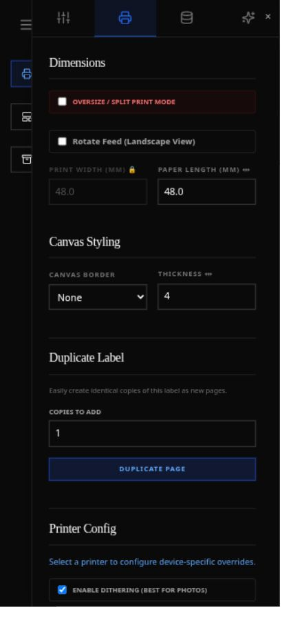

# Measured baseline

Captured on 2 October 2026 at source commit `c193e93d82b13724196aa29b22d52055fd112406`. Application source and lockfiles were unchanged. Checks used disposable environments; browser inspection used a separate app copy and database. The [plan](plan.md) defines proposed gates; the measurements below are not those gates already being enforced.

## Current results

| Check | Measured result | Interpretation |
| --- | --- | --- |
| Frontend existing ESLint | 0 errors / 0 warnings | Current rules pass; they cover only two Hooks rules. |
| Frontend Vitest | 21 tests passed, six files | Existing suite only, not full editor/browser acceptance. |
| Production frontend build | Passed, large lazy-chunk warnings | Build success does not establish render fidelity or performance. |
| Full installed React Hooks recommended rules | 19 errors: 11 `set-state-in-effect`, eight `static-components` | Additional review scope, not 19 independently reproduced bugs. |
| Knip with source/config entry scope | Two unused exports; no reported unused files/dependencies | `checkServerHealth` and the `sanitizeLabelHtml` re-export require review. Default discovery falsely includes 22 generated dist files. |
| Backend unittest after scratch schema initialization | 66/67 passed; one failure | A launcher test expects Windows separators on Linux. Native Windows result remains unverified. |
| Backend first run with empty scratch database | 64 passed, one failure, two errors | Print-route tests rely on an existing settings table. Normal scratch schema initialization resolved both errors. Test isolation needs repair. |
| Ruff default | 36 diagnostics in 14 files | Includes four undefined annotation names and ten unused imports. |
| Ruff expanded `E,F,I,UP,B,SIM,C4` | 1,271 diagnostics in 98 files | E501 accounts for 652; excluding it leaves 619. This is broader than the proposed initial gate. |
| Ruff formatter | 83 files would change; 37 already formatted | Check only; no formatting was applied. |
| basedpyright standard | 199 errors in 37 files; zero warnings | Seven missing imports are environment gaps: six Windows SDK imports, one optional Playwright import. The other 192 diagnostics are not individually validated runtime bugs. |
| Vulture, confidence >=80% | Zero findings | Advisory result, not proof of no dead code. |
| Python AST import graph | 120 modules, 430 edges; two full-graph SCCs | SCC sizes two and 18. Excluding function-local and `TYPE_CHECKING` edges yields **zero import-time SCCs**. Structural coupling remains worth improving; no import crash was demonstrated. |
| npm audit | Ten vulnerable package entries: four high, five moderate, one low, zero critical | Includes dev/transitive packages. Advisory reachability differs; see [dependency assessment](dependencies.md). No Python advisory audit was run. |

The initial JavaScript and three modulepreloads total 776,074 bytes, or 228,017 bytes when gzip-compressed individually. Lazy chunks include IconPicker 763.52 KB and bwip-js 951.49 KB. These are built asset sizes, not network transfer or startup-duration measurements.

## Environment and reproducibility

Frontend: Node 24.18.0, npm 11.16.0; `npm ci` against the existing lockfile in `/tmp/catlabel-review-20261002/frontend`. Existing checks were `npm run lint`, `npm run test` and `npm run build`. Expanded Hooks checking used `npx eslint src --config audit-eslint.config.js --format json`. Knip used `npx knip --config knip.audit.json --reporter json`, resolving cached Knip 6.39.0; pin it when implementing the policy rather than relying on a future `npx` resolution. The scratch configurations are retained as [Hooks configuration](evidence/audit-eslint.config.js) and [Knip configuration](evidence/knip.audit.json), with [diagnostics](evidence/react-recommended.json) and [Knip output](evidence/knip.json). Existing [lint](evidence/frontend-lint.log), [test](evidence/frontend-tests.log) and [build](evidence/frontend-build.log) logs are also retained.

Backend: Linux fc44 host; system Python 3.14.7, but all tests/typing/benchmark work used an isolated Python 3.11.15 environment. Tool versions: Ruff 0.15.22, basedpyright 1.40.1, Vulture 2.16. Python scope was `catlabel`, `launcher.py`, `tools`, `tests` (120 files). The project's Pixi lock targets only win-64; the scratch Unix environment resolved broad `requirements.txt`, so it is **not a test of the Windows locked environment**.

Commands, from repository root unless stated:

```sh
ruff check --output-format json catlabel launcher.py tools tests
ruff check --select E,F,I,UP,B,SIM,C4 --output-format json catlabel launcher.py tools tests
ruff format --check catlabel launcher.py tools tests
basedpyright --project /tmp/catlabel-review-20261002/baseline/basedpyrightconfig.json --outputjson
vulture catlabel launcher.py tools tests --min-confidence 80
```

The type-check configuration selects Python 3.11, Linux, standard mode and the scratch venv. Its optional Playwright diagnostic was captured before installing Playwright 1.63.0; it was not rerun afterward. Windows SDK diagnostics require the appropriate native feature environment. The retained [configuration](evidence/basedpyrightconfig.json) contains original scratch-relative paths; adapt those paths before reusing it elsewhere.

Tests ran with cwd `/tmp/catlabel-review-20261002/baseline`, `PYTHONPATH` set to the repository and `PYTHONDONTWRITEBYTECODE=1`, using that venv's Python:

```sh
python -m unittest discover -s /home/lliniewicz/Projects/catlabel/tests -t /home/lliniewicz/Projects/catlabel -v
```

Between the initial and second runs, `catlabel.api.routes_print` was imported and `catlabel.core.database.create_db_and_tables()` initialized **only the scratch database**. All 11 tables had zero rows at inspection. See the [initial log](evidence/unittest.log), [second log](evidence/unittest-with-scratch-schema.log) and [full backend counts](evidence/backend-counts.json) for exact invocations, package versions and per-rule/file breakdowns. Test dependencies changed afterward when launcher/headless tooling was installed; those timings and differences are recorded in the counts file.

## Bounded performance experiment

The parent specified four deterministic horizontal/vertical grayscale gradient fixtures: 384×384 and 816×1218. Each method received one warm-up and three timed runs, with source first and the scratch candidate second. The candidate changed only enhancement-alpha computation from 256 times inside a LUT to once before it. Python 3.11.15 / Pillow 12.3.0 were fixed.

| Fixture | Source median | Hoisted median | Speedup |
| --- | ---: | ---: | ---: |
| Horizontal 384×384 | 44.623 ms | 3.919 ms | 11.385× |
| Vertical 384×384 | 78.918 ms | 5.110 ms | 15.442× |
| Horizontal 816×1218 | 196.848 ms | 25.067 ms | 7.853× |
| Vertical 816×1218 | 405.596 ms | 25.848 ms | 15.692× |

Output bytes, mode, dimensions and checksums matched exactly in all cases. This is a function microbenchmark on synthetic inputs, with possible method-order bias, not end-to-end printing or a production change. Python-traced peaks exclude native Pillow memory. [Protocol/results](evidence/raster-results.md), [machine results](evidence/raster-results.json), [scratch measurement script](evidence/raster-measurement.py).

## Browser observations and unmeasured acceptance

The rebuilt production frontend was inspected at the default 1222 px width and 390×844. At mobile width the properties overlay covers most of the canvas; seventeen visible text-element property fields lacked associated labels or accessible names. Setup, offline printer state, save-state omissions and component structure are described in the [review](README.md).



The [desktop editor screenshot](evidence/desktop-editor.png) is also retained. No print was submitted. Font downloading was disabled; an initial real discovery scan occurred before the incomplete scan stub was identified. No connection/physical-print acceptance, native Windows/macOS installation, full accessibility audit, representative browser latency/heap profile or Playwright thread-failure reproduction was completed.

Machine-readable [combined summary](evidence/summary.json), [Ruff default](evidence/ruff-default.json), [expanded Ruff](evidence/ruff-expanded.json), [typing](evidence/basedpyright-standard.json), [import graph](evidence/python-import-graph.json), [import-edge classification](evidence/import-cycle-classification.json) and [npm audit](evidence/npm-audit.json) preserve the evidence behind the plan.
